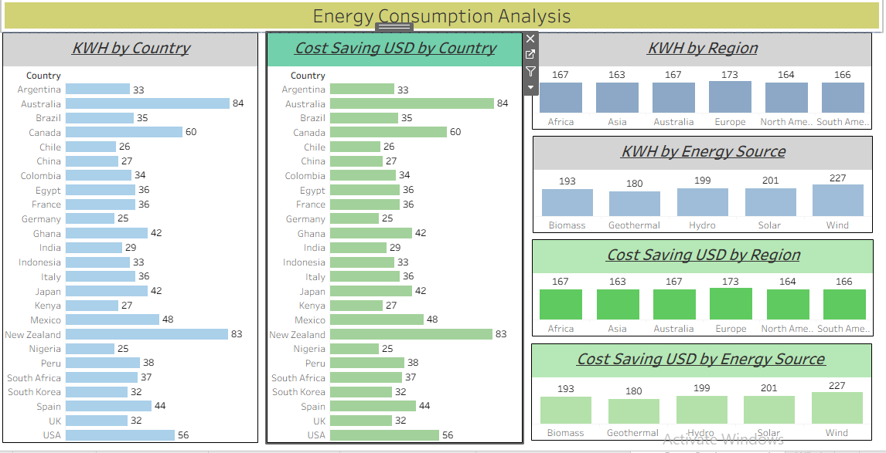

# ⚡ Energy Consumption Analysis Dashboard

An interactive **Tableau** analytical suite designed to process 1,800+ lines of workbook metadata to visualize global energy consumption patterns, efficiency metrics, and financial impact.

---
## 📸 Dashboard Preview




## 🚀 Overview

This **Energy Consumption Analysis** project provides a deep dive into power usage (KWH) and cost efficiency (USD). By leveraging Tableau’s XML-based workbook structure, the dashboard identifies high-usage zones and correlates consumption data with regional economic savings.

The goal is to provide **actionable insights** into energy distribution and identify where consumption optimization can lead to the highest financial recovery.

---

## 📌 Key Insights

* **Regional Peaks:** High-density consumption identified across Australia and New Zealand.
* **Cost Correlation:** A direct linear relationship exists between optimized energy usage and net cost savings.
* **Efficiency Leaders:** Europe shows the highest efficiency ratio between energy spent vs. cost saved.
* **Source Breakdown:** Analysis of diverse energy sources to determine which provides the most stable "cost-per-KWH" return.

---

## 📊 Dashboard Features

* **Consumption Mapping (KWH):** Geographic heatmaps comparing power usage by country.
* **Financial Impact (USD):** Country-level analysis of cost savings and expenditure.
* **Regional Aggregation:** High-level views of energy trends across different continents.
* **Source-Specific Metrics:** Granular breakdown of consumption by energy category.
* **Efficiency Matrix:** Identifying the most cost-effective energy strategies by region.

---

## 🛠️ Technical Stack

* **Visualization:** Tableau Desktop / Public
* **Workbook Architecture:** 1.8k+ lines of `.twb` XML metadata management
* **Data Handling:** Structured CSV/Excel datasets
* **Version Control:** Git & GitHub

---

## 📁 Project Files

* `EnergyConsumptionAnalysis.twb` – The primary Tableau workbook file.
* `Energy_Data.csv` – The raw dataset containing KWH and USD metrics.

---

## 📥 How to Run

1.  **Clone the repository:**
    ```bash
    git clone [https://github.com/Dheeraj-Git-23/EnergyConsumptionAnalysis](https://github.com/Dheeraj-Git-23/EnergyConsumptionAnalysis)
    ```
2.  **Open the file:**
    Launch the `.twb` file using **Tableau Desktop** (Free/Student Edition) or **Tableau Reader**.
3.  **Explore:**
    Use the interactive filters to drill down into specific regions or energy sources.

---

## 👨‍💻 Author

**Dheeraj Reddy**
